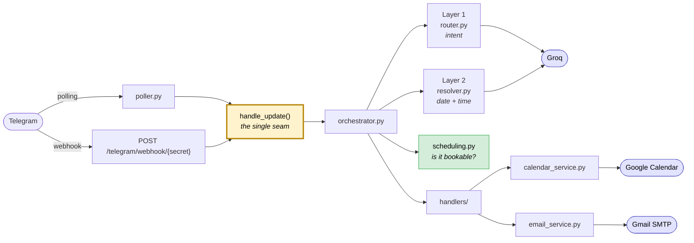
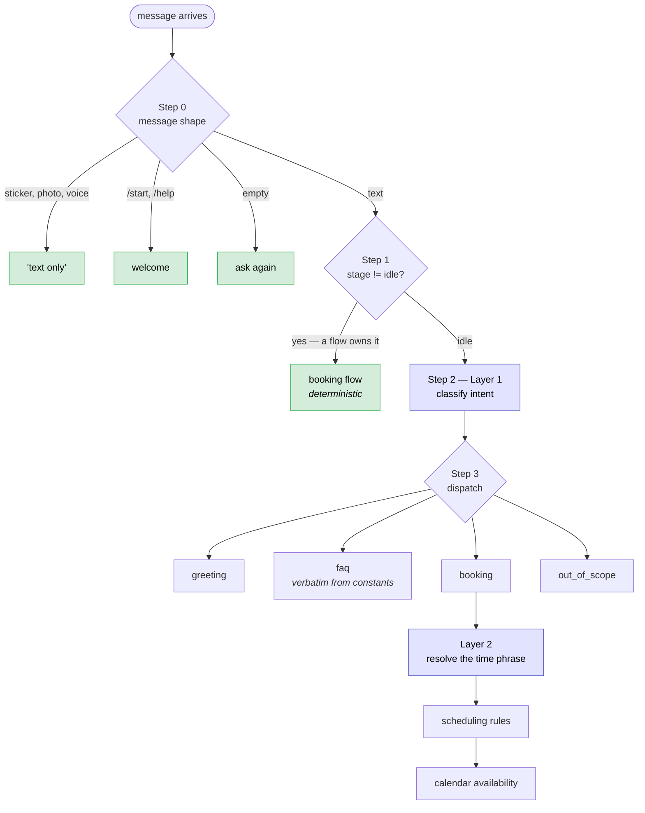
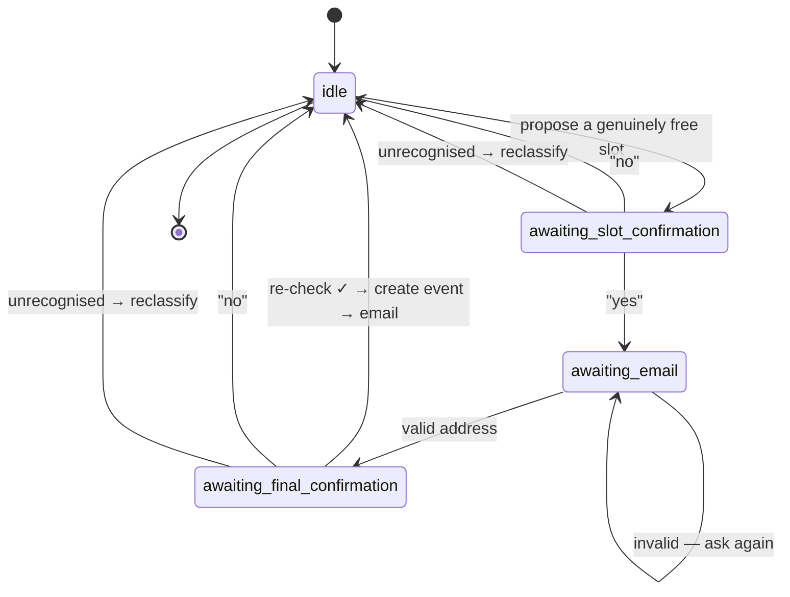
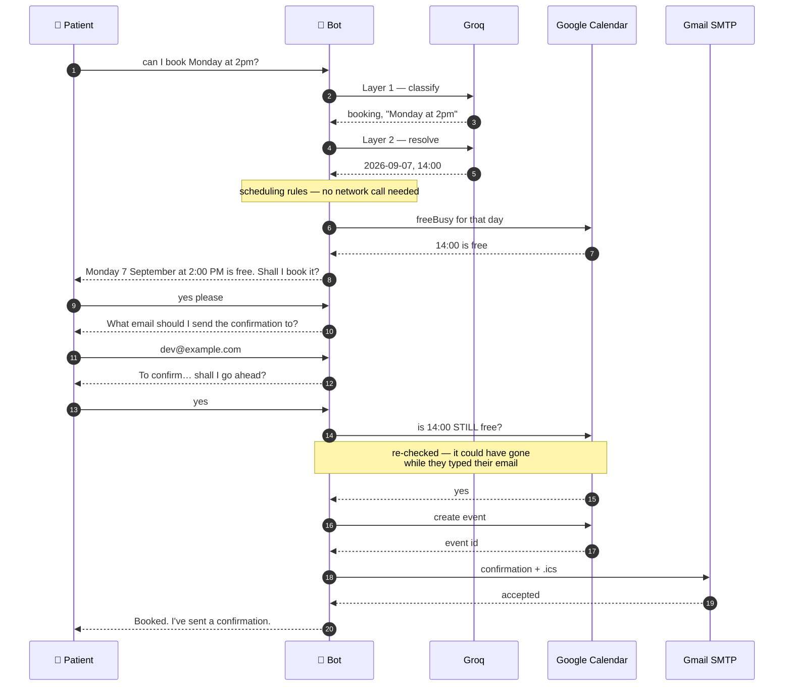
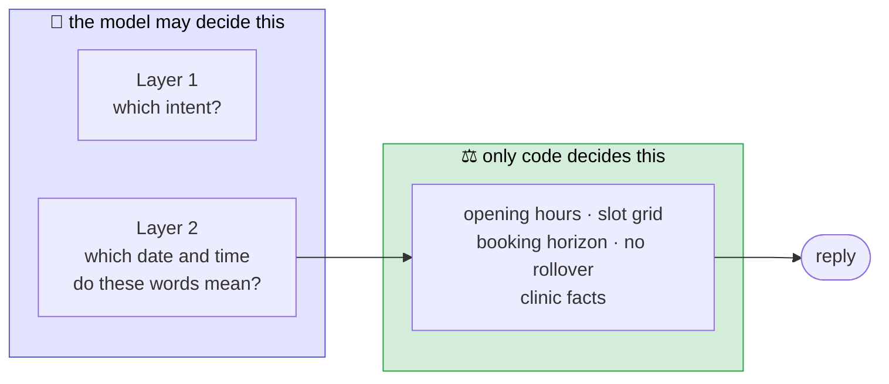
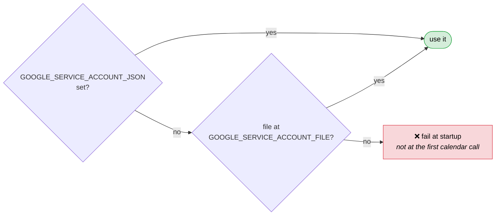
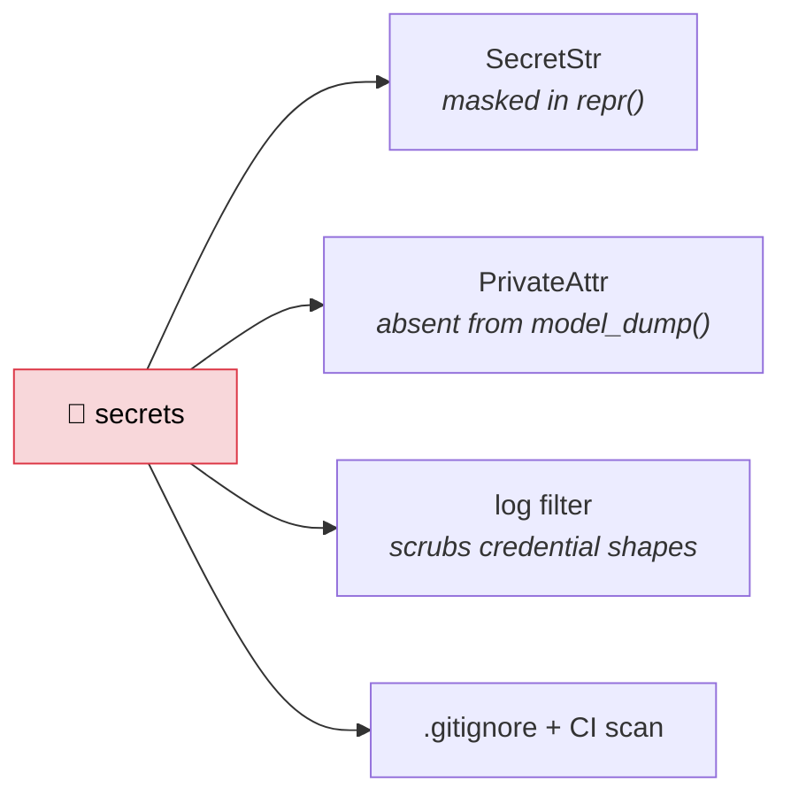

# 🏥 BrightCare Clinic — Telegram appointment agent

[](https://github.com/0DevDutt0/BrightCare-Clinic-Bot/actions/workflows/ci.yml)


A conversational agent that answers questions about a clinic and books real
appointments over Telegram — backed by a live Google Calendar, confirmed by email.

---

## What it actually does

```
🧑  can I book Monday at 2pm?
🤖  Monday 7 September at 2:00 PM is free. It runs 30 minutes. Shall I book it?

🧑  yes please
🤖  Lovely. What email address should I send the confirmation to?

🧑  dev@example.com
🤖  Thanks. To confirm: Monday 7 September at 2:00 PM at 12 Orchard Rd, and I'll
    send the confirmation to the address you gave me. Shall I go ahead and book it?

🧑  yes
🤖  Booked. Your appointment is Monday 7 September at 2:00 PM at 12 Orchard Rd.
    I've sent a confirmation to your email.
```

That exchange creates a genuine Google Calendar event and delivers a real email with an
`.ics` attachment. It costs **two LLM calls in total** — both on the first turn.

It also knows when to say no:

| you say | it replies |
|---|---|
| `do you have anything Saturday?` | We're closed that day… the next day we're open is Monday 7 September. |
| `can I come in last Tuesday?` | That date has already passed. |
| `at 7pm on Tuesday` | We don't have any slots left that late. |
| `book me for 2:15 on Monday` | The nearest slot is **2:30 PM** — the first opening at or after the time you asked for. |
| `what's the weather in Paris?` | Sorry, I can't help with that one. |
| *(a sticker)* | I can only read text messages right now. **← zero LLM calls** |

---

## Architecture



Both transports converge on **one** `handle_update()`. Nothing below that line knows
which delivered the message — so the agent is testable without either, and deployment
switches modes with an env var.

---

## How a message is routed

Each step is a chance to answer **without** calling the model. Only a message that
survives all of them costs a classification.



> 🟩 free · 🟦 one Groq call

**What each message actually costs:**

| message | LLM calls |
|---|---|
| a sticker, `/start`, an empty message | **0** |
| `hi` · `where are you?` · `what's the weather?` | **1** |
| `can I book Monday at 2pm?` | **2** (classify + resolve) |
| `yes` · `no` · your email address, mid-flow | **0** |

### Step 1 before Step 2 is the load-bearing decision

If the bot has asked *"is 2pm alright?"* and you reply *"yes"*, classifying that message
in isolation returns `greeting` — confidently, and wrongly. **The conversation stage
decides who owns a message; the words alone cannot.**

---

## The booking conversation



Every transition is deterministic. Classifying "yes" would double the cost of a booking
and add a failure mode to the least ambiguous message in the conversation.

Yes/no parsing requires **every** word to be recognised:

| reply | read as | why |
|---|---|---|
| `yeah go ahead` | ✅ yes | every word known |
| `no thanks` | ❌ no | a negative anywhere wins |
| `ok Tuesday` | ↩️ *reclassify* | names a day the bot never proposed — confirming the old slot would book the wrong appointment |
| `actually can we do 4pm?` | ↩️ *reclassify* | a changed request, not a failed yes/no |

An unrecognised reply goes **back to the classifier** rather than being told to say yes
or no. So "actually can we do 4pm?" re-proposes 4pm.

### A complete booking, end to end



**Availability is re-checked immediately before the event is created.** A slot free when
proposed can be taken while the user types their email — booking on the earlier answer
is how two patients end up in one slot.

---

## Two layers, split by what each is trusted with



The model is **never told the opening hours** — and a test asserts the prompt doesn't
mention them.

> A model that misreads "Monday" produces a wrong **date**, which the user can see and
> correct. A model trusted with policy produces a wrong **rule**, which they cannot.

The same principle governs FAQs: answers are returned verbatim from
`app/domain/business.py`, so invented clinic facts are *structurally impossible* rather
than merely discouraged.

Validation **refuses rather than reroutes**. Weekends, past dates and after-hours
requests are declined with an explanation; `next_open_day` only ever *suggests* an
alternative, because `NEAREST_AVAILABLE_RULE` forbids rolling a booking onto another
day. Within a day it does move forward: 14:15 → 14:30 (always rounding **up**, never
offering a slot before the one asked for), and asking for 9am at 11:30 offers 11:30 with
the reason stated — a silent shift is how a patient turns up an hour out.

---

## Quick start

```bash
python -m venv venv
venv/Scripts/pip install -r requirements-dev.txt   # Linux/macOS: venv/bin/pip
cp .env.example .env                               # then fill in the blanks
venv/Scripts/python -m uvicorn app.main:app --port 8000
```

Message the bot on Telegram. `GET /health` reports the resolved run mode.

> [!IMPORTANT]
> `tzdata` is a real dependency, not a nicety. Windows ships no system time zone
> database, so `ZoneInfo("Asia/Kolkata")` raises `ZoneInfoNotFoundError` without it and
> the app cannot construct a single valid appointment time.

> [!WARNING]
> **Environment variables outrank `.env`.** That is deliberate — it is how a host
> injects config in production — but a stray `TELEGRAM_BOT_TOKEN` or `GROQ_API_KEY` in
> your shell silently wins over the file. If the bot seems to ignore an edit:
> ```bash
> env -u TELEGRAM_BOT_TOKEN -u GROQ_API_KEY ./venv/Scripts/python -m uvicorn app.main:app --port 8000
> ```

---

## Configuration

Every value comes from the environment; see `.env.example`. Five keys are required and
validated **at startup**, with an error naming the missing one: `TELEGRAM_BOT_TOKEN`,
`GROQ_API_KEY`, `GROQ_MODEL`, `GOOGLE_CALENDAR_ID`, `TIMEZONE`.

Google credentials resolve in order:



The file path resolves against the **project root**, not the working directory, so the
app starts identically from anywhere.

> [!CAUTION]
> In a `.env` file the inline JSON **must be wrapped in single quotes**. Double quotes
> make dotenv expand the `\n` escapes inside `private_key` into real newlines, and a raw
> newline inside a JSON string is invalid JSON.

`settings.email_configured` picks between the real SMTP service and a disabled one at
startup, so the app books appointments without SMTP credentials — only the confirmation
is lost, and the reply says so rather than promising one.

---

## Transports

| `RUN_MODE` | Mechanism | When |
|---|---|---|
| `polling` | background `getUpdates` loop | local dev — no public URL needed |
| `webhook` | `POST /telegram/webhook/{secret}` | deployment |

Webhook mode requires `TELEGRAM_WEBHOOK_SECRET` and `PUBLIC_BASE_URL`, checked at
startup. The route **always returns 200** — a non-200 makes Telegram redeliver with
backoff, so a bug that reliably 500s becomes a retry storm that outlives the deploy.

---

## Design decisions worth defending

<details>
<summary><b>Calendar events never carry attendees</b> — and this one is not optional</summary>

A service account without Domain-Wide Delegation gets `HTTP 403
forbiddenForServiceAccounts`, and that fails the **entire** event creation rather than
degrading. One attendee field would break every booking. Delegation needs a Workspace
domain a personal calendar cannot grant, so the patient's address goes in the event
description, and the `.ics` attachment on the confirmation email is the only route the
appointment has into their own calendar.

*The event is the clinic's record; the email is the patient's.*
</details>

<details>
<summary><b><code>max_tokens</code> is 1024, and the reason is not obvious</b></summary>

Reasoning models spend hidden reasoning tokens *inside* that budget before writing any
answer — measured at **346–376** on this task. The original 300 left no room for the
JSON, and Groq rejected the call with `HTTP 400 json_validate_failed` and an empty
`failed_generation`.

It failed on exactly the inputs a classifier most needs to get right (`"2:15 on Monday"`,
`"7pm on Tuesday"`) and passed on easy ones, so it presented as flakiness. **No unit
test could catch it**, since every test fakes the model; `tests/test_llm.py` asserts the
floor and records why.
</details>

<details>
<summary><b>A failed email never rolls back a booked appointment</b></summary>

The calendar event and the email fail independently, and the reply states which of the
two happened rather than promising a confirmation that never left.
</details>

<details>
<summary><b>Slot overlap is half-open at both ends</b></summary>

Back-to-back appointments are not clashes. Treating a shared boundary as a collision
would lose the slot either side of every existing event — about a third of a working
day, for nothing.
</details>

<details>
<summary><b>Naive datetimes raise at construction</b></summary>

Rather than being caught by convention. A naive value reaching the slot search either
raises deep in the call stack or, worse, silently represents the wrong wall clock.
</details>

<details>
<summary><b><code>StateStore</code> is async despite needing no I/O</b></summary>

The intended swap is Redis, whose clients are async. A sync interface would force every
handler to change when that lands.
</details>

<details>
<summary><b>The OpenAI SDK's own retries are disabled</b> (<code>max_retries=0</code>)</summary>

Left on, the required "one retry" silently becomes several, multiplying the wall-clock
time a user waits.
</details>

<details>
<summary><b>No <code>google-api-python-client</code></b></summary>

It is synchronous and builds its own HTTP stack; only four endpoints are needed, so they
are called over httpx directly. `google-auth` is installed without its `[requests]`
extra for the same reason, with an httpx transport supplied in `calendar_service.py`.
</details>

<details>
<summary><b>Deduplication is bounded</b></summary>

A deque plus a set, capped. Telegram redelivers until acknowledged, and an unbounded set
grows for the life of the process.
</details>

---

## Deployment

```bash
docker build -t brightcare-clinic-bot .
docker run -p 8000:8000 --env-file .env brightcare-clinic-bot
```

The image is host-agnostic; `render.yaml` is one worked example, not a requirement.

### Choose the service type first — it decides everything else

| host service type | `RUN_MODE` | why |
|---|---|---|
| background worker / always-on | `polling` | no public URL needed; simplest |
| free-tier **web** service | `webhook` | free tiers sleep when idle, and a sleeping worker cannot poll — the inbound request is what wakes it |

### The chicken-and-egg step

`PUBLIC_BASE_URL` cannot be set before the service exists, because the host assigns it:


Startup refuses webhook mode without `PUBLIC_BASE_URL` **and**
`TELEGRAM_WEBHOOK_SECRET`, so a half-configured deploy fails immediately with a message
naming the missing key rather than going quietly deaf.

### One worker, deliberately

`--workers 1` is pinned in the Dockerfile. Conversation state lives in memory, so a
second worker is a second process with its own view of every conversation — a user could
be asked for their email by one worker and have the reply land on another that has never
heard of them. State also does not survive a restart, which free tiers do often: an
in-flight booking is lost, though a **completed** one is safe on the calendar. Both are
fixed by the same thing — the Redis backend the `StateStore` interface already allows.

### CI

`.github/workflows/ci.yml` runs on every push and pull request:

| job | what it proves |
|---|---|
| **test** | the full suite runs with **no secrets**, because every external service is faked |
| **secrets** | no credential shapes in tracked files, and `.env` / `credentials/` are still ignored |
| **build** | the image assembles, serves `/health`, runs unprivileged, and carries no `.env` |

The PEM pattern requires real key material *after* the marker, so test fixtures
containing `BEGIN PRIVATE KEY-----\nnotarealkey` don't trip it — a scanner that cries
wolf is one that gets disabled. The build job generates a throwaway RSA key with
`openssl`, because a placeholder string cannot work: config resolves credentials eagerly
and google-auth rejects a fake PEM.

---

## Secrets



`.env`, `credentials/` and conversation exports are gitignored. Logging defends the same
data twice: callers log `text_fingerprint()` (length plus a short hash) rather than
message bodies, **and** a filter scrubs credential patterns at every level plus emails
from user-content fields at INFO and above. `httpx` is held at WARNING because its INFO
request line contains the bot token.

---

## Tests

```bash
venv/Scripts/python -m pytest
```

**327 tests.** Groq is faked at the `complete_json` seam — the narrowest point that still
exercises parsing, validation and error handling. Google is faked at the HTTP layer with
`respx`, so request bodies are *asserted* rather than assumed.

Several tests assert work **not** done:

- a sticker costs zero model calls
- a mid-flow reply skips the classifier entirely
- a booking with no time phrase never reaches Layer 2
- `create_event` never sends an `attendees` key

### Verified by mutation, not just by passing

Each of these deliberate breakages turns the suite red:

| mutation | caught by |
|---|---|
| round slots **down** instead of up | 9 tests |
| drop the weekend check | 5 tests |
| roll a late request to the next day | 4 tests |
| skip the pre-booking availability re-check | 2 tests |
| accept `"ok Tuesday"` as a yes | 4 tests |
| send attendees to Google | 1 test |
| let a failed email roll back the booking | 1 test |
| leave a placeholder unsubstituted in a prompt | 1 test |

---

## Layout

```
app/
  config.py            settings, credential resolution, ZoneInfo
  logging_config.py    JSON logs, secret redaction
  main.py              FastAPI, lifespan, /health, webhook route
  telegram/            client, handle_update entrypoint, polling runner
  agent/               llm, router (Layer 1), resolver (Layer 2),
                       orchestrator, prompts, handlers/
  state/               ConversationState, StateStore + InMemoryStateStore
  domain/business.py   clinic facts, hours, slot grid, booking rule
  domain/scheduling.py business-hours validation, slot alignment
  services/            calendar + email, both live
prompts/               the prompt driving each phase, with its assumptions
tests/
```

---

## Phase status

| Phase | Scope | State |
|---|---|---|
| 1 | Scaffold, transports, routing layer | ✅ complete |
| 2 | Datetime resolution, business-hours validation | ✅ complete |
| 3 | Calendar availability, slot search, event creation | ✅ complete |
| 4 | Email confirmation | ✅ complete |
| 5 | Deployment | ✅ complete |

Each phase's prompt and its full assumption list live in [`prompts/`](prompts/).
