<div align="center">

# 🏥 BrightCare Clinic — Telegram appointment agent

**Books, moves and cancels real clinic appointments over chat.**
Backed by a live Google Calendar, confirmed by email, and gated behind a one-time code.

[](https://github.com/0DevDutt0/BrightCare-Clinic-Bot/actions/workflows/ci.yml)


**509 tests** · **34 mutations, all caught** · **2 LLM calls per booking, 0 to confirm one**

</div>

---

## See it working

Not a mock-up. A live Telegram bot, a real Google Calendar event, and a real email —
the same three artefacts every transcript in this README produces.

<table>
<tr>
<td width="36%" valign="top">
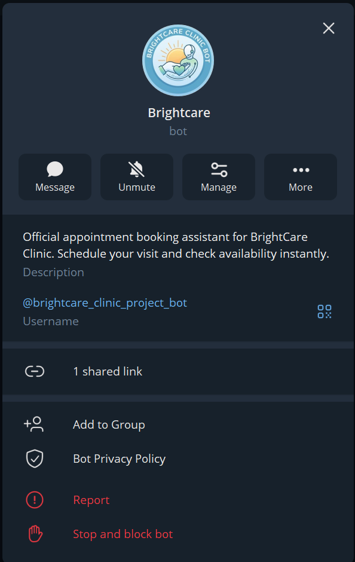
</td>
<td width="64%" valign="top">
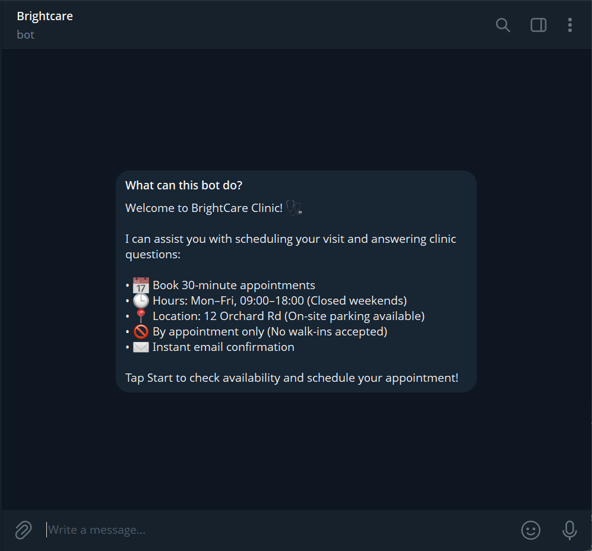
</td>
</tr>
<tr>
<td colspan="2" align="center">
<sub><b>Live on Telegram</b> — every clinic fact in that welcome is served verbatim from <code>app/domain/business.py</code>. The model is never given the chance to invent one.</sub>
</td>
</tr>

<tr>
<td colspan="2" valign="top">
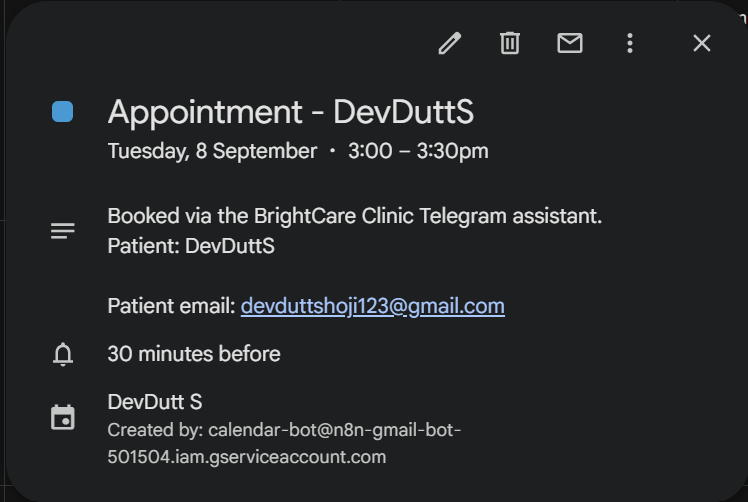
</td>
</tr>
<tr>
<td colspan="2" align="center">
<sub><b>A real Google Calendar event</b> — written by the service account. The patient's address sits in the description rather than the attendee list, because a service account without Domain-Wide Delegation gets <code>403 forbiddenForServiceAccounts</code> and that fails the <i>entire</i> booking. <a href="#design-decisions-worth-defending">Why →</a></sub>
</td>
</tr>

<tr>
<td colspan="2" valign="top">
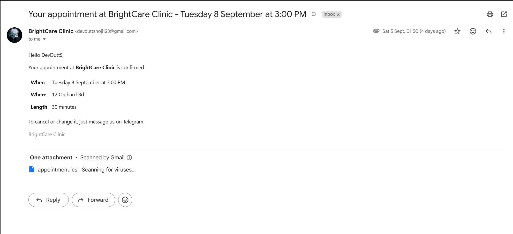
</td>
</tr>
<tr>
<td colspan="2" align="center">
<sub><b>A real confirmation email</b> — delivered over Gmail SMTP, carrying an <code>.ics</code> attachment. Because the patient cannot be an attendee, that file is the <i>only</i> route the appointment has into their own calendar — which is why its UID is carried across a reschedule rather than regenerated.</sub>
</td>
</tr>
</table>

---

## Three things it does, one gate they share

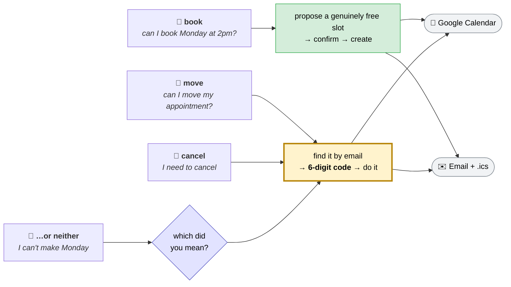

Booking is forgiving — a wrong slot is one message away from being fixed. **Cancelling is
not**, and moving an appointment cancels one. So everything on the right of that diagram
has to answer a question booking never asks: *is the person typing entitled to do this?*

---

## If you only read one section

| | |
|---|---|
| 🧠 **The model is never trusted with policy** | Two LLM layers decide *intent* and *what "Monday at 2pm" means*. Opening hours, the slot grid and the booking rules are pure code — and a test asserts the prompt never mentions them. A model that misreads a date produces a wrong **date**, which a patient can see and correct; a model trusted with a rule produces a wrong **rule**, which they cannot. |
| 🔐 **Cancelling requires proof, not a claim** | Telegram proves this is the same chat as yesterday — not which patient it is. A 6-digit code goes to the address the booking was made with. Only a salted SHA-256 reaches state; three attempts against 10⁶; ten-minute expiry. |
| 🧪 **34 deliberate bugs, all caught — but 3 escaped first** | A green suite proves the code does what the tests say, not that the tests would notice if it stopped. One of the three that initially slipped through would have let a single code authorise cancelling **any** appointment the chat could find afterwards. [The full account →](#three-of-them-passed-on-the-first-attempt) |
| ⚖️ **Failure modes are chosen, not discovered** | A reschedule books the new time *before* releasing the old one — losing an appointment is worse than briefly having two, and the half-done case is reported in plain words. A broken mail server never rolls back a real booking. |
| 🌍 **It runs against the real thing** | Not just fakes — 16/16 checks against a live Google Calendar for cancellation, 14/14 for rescheduling. Writing those checks is what surfaced a lookup bug the unit suite was structurally blind to, and only a real round trip proves the service account has delete scope or that Google hands extended properties back as strings. |
| 🚢 **Shipped, not just written** | Dockerised, host-agnostic, CI on every push — tests with *no secrets* because every external service is faked, a credential scanner, and an image smoke test that boots the container and curls `/health`. |

<details>
<summary><b>Contents</b></summary>

- [See it working](#see-it-working) — screenshots of the live bot, calendar and email
- [What it actually does](#what-it-actually-does) — real transcripts
- [Architecture](#architecture) · [How a message is routed](#how-a-message-is-routed)
- [The booking conversation](#the-booking-conversation)
- [Changing an appointment: cancel, or move](#changing-an-appointment-cancel-or-move)
- [Two layers, split by what each is trusted with](#two-layers-split-by-what-each-is-trusted-with)
- [Quick start](#quick-start) · [Configuration](#configuration) · [Transports](#transports)
- [Design decisions worth defending](#design-decisions-worth-defending) — 13 of them
- [Deployment](#deployment) · [Secrets](#secrets)
- [Tests](#tests) — including [verification by mutation](#verified-by-mutation-not-just-by-passing)
- [Layout](#layout) · [Phase status](#phase-status)

</details>

---

## What it actually does

```
🧑  can I book Monday at 2pm?
🤖  Monday 7 September at 2:00 PM is free. It runs 30 minutes. Shall I book it?

🧑  yes please
🤖  Lovely. What email address should I send the confirmation to?

🧑  dev@example.com
🤖  Thanks. To confirm: Monday 7 September at 2:00 PM at 12 Orchard Rd, and I'll
    send the confirmation to the address you gave me. Shall I go ahead and book it?

🧑  yes
🤖  Booked. Your appointment is Monday 7 September at 2:00 PM at 12 Orchard Rd.
    I've sent a confirmation to your email.
```

That exchange creates a genuine Google Calendar event and delivers a real email with an
`.ics` attachment. It costs **two LLM calls in total** — both on the first turn.

And it can undo one — but not on your say-so alone:

```
🧑  I need to cancel my appointment
🤖  Which email address was the appointment booked with? I'll send a code there to
    check it's you.

🧑  dev@example.com
🤖  I found an appointment for Dev on Monday 7 September at 2:00 PM at 12 Orchard Rd,
    booked with dev@example.com.
    Shall I cancel it? I'll email a 6-digit code to that address first.

🧑  yes
🤖  I've emailed a 6-digit code to dev@example.com. It expires in 10 minutes.

🧑  421052
🤖  Done — your appointment on Monday 7 September at 2:00 PM is cancelled and the
    slot is free again. I've emailed you a confirmation.
```

**One LLM call**, on the first message. Telegram proves this is the same chat as
yesterday; it does not prove which patient that is. The code does.

Moving one runs the same gauntlet — and when the message doesn't say *which*, the bot
asks instead of guessing:

```
🧑  something came up, I can't make Monday
🤖  Which email address was the appointment booked with?

🧑  dev@example.com
🤖  I found an appointment for Dev on Monday 7 September at 2:00 PM at 12 Orchard Rd.
    Would you like to move it to another time, or cancel it altogether?

🧑  reschedule
🤖  What day and time would suit you instead?

🧑  Wednesday at 11
🤖  Wednesday 9 September at 11:00 AM is free. Shall I move your appointment from
    Monday 7 September at 2:00 PM to then? I'll email a 6-digit code first.

    … yes, then the code …

🤖  Done — your appointment has moved from Monday 7 September at 2:00 PM to
    Wednesday 9 September at 11:00 AM. The earlier time is free again.
```

*"I can't make Monday"* is a problem with an appointment, not an instruction about one.
Guessing there either destroys a booking the patient meant to keep or leaves one they
meant to drop, so the classifier is told to hand the ambiguity back rather than pick.

It also knows when to say no:

| you say | it replies |
|---|---|
| `do you have anything Saturday?` | We're closed that day… the next day we're open is Monday 7 September. |
| `can I come in last Tuesday?` | That date has already passed. |
| `at 7pm on Tuesday` | We don't have any slots left that late. |
| `book me for 2:15 on Monday` | The nearest slot is **2:30 PM** — the first opening at or after the time you asked for. |
| `what's the weather in Paris?` | Sorry, I can't help with that one. |
| *(moving to the time you already hold)* | That's already when your appointment is. |
| *(a change, with an address that booked nothing)* | I couldn't find an upcoming appointment booked with that. **← and no code is emailed** |
| *(a sticker)* | I can only read text messages right now. **← zero LLM calls** |
---

## Architecture


Both transports converge on **one** `handle_update()`. Nothing below that line knows
which delivered the message — so the agent is testable without either, and deployment
switches modes with an env var.

---

## How a message is routed

Each step is a chance to answer **without** calling the model. Only a message that
survives all of them costs a classification.

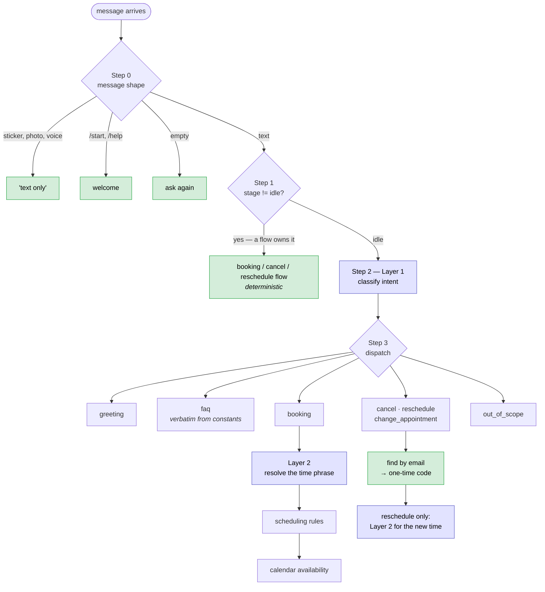

> 🟩 free · 🟦 one Groq call

**What each message actually costs:**

| message | LLM calls |
|---|---|
| a sticker, `/start`, an empty message | **0** |
| `hi` · `where are you?` · `what's the weather?` | **1** |
| `I need to cancel my appointment` | **1** — and the whole cancellation is that one |
| `can I book Monday at 2pm?` | **2** (classify + resolve) |
| `yes` · `no` · your email address · a 6-digit code, mid-flow | **0** |
| a reschedule, end to end | **2 minimum** — see below |

A reschedule is the only flow whose cost is not fixed. Classifying costs one; resolving
the new time costs another, several turns later — and a patient who tries three times
before finding a slot they like pays for three of those. That second call is also the
only **in-flow** message in the app that costs anything at all, so the handler reports it
rather than letting the orchestrator assume a continuation was free.

> [!NOTE]
> A time named in the opening message — *"can I move my appointment **to Friday**?"* — is
> not carried into the flow; the bot asks again once it has found the appointment. Wiring
> it through would save a turn and is not done.

### Step 1 before Step 2 is the load-bearing decision

If the bot has asked *"is 2pm alright?"* and you reply *"yes"*, classifying that message
in isolation returns `greeting` — confidently, and wrongly. **The conversation stage
decides who owns a message; the words alone cannot.**

---

## The booking conversation

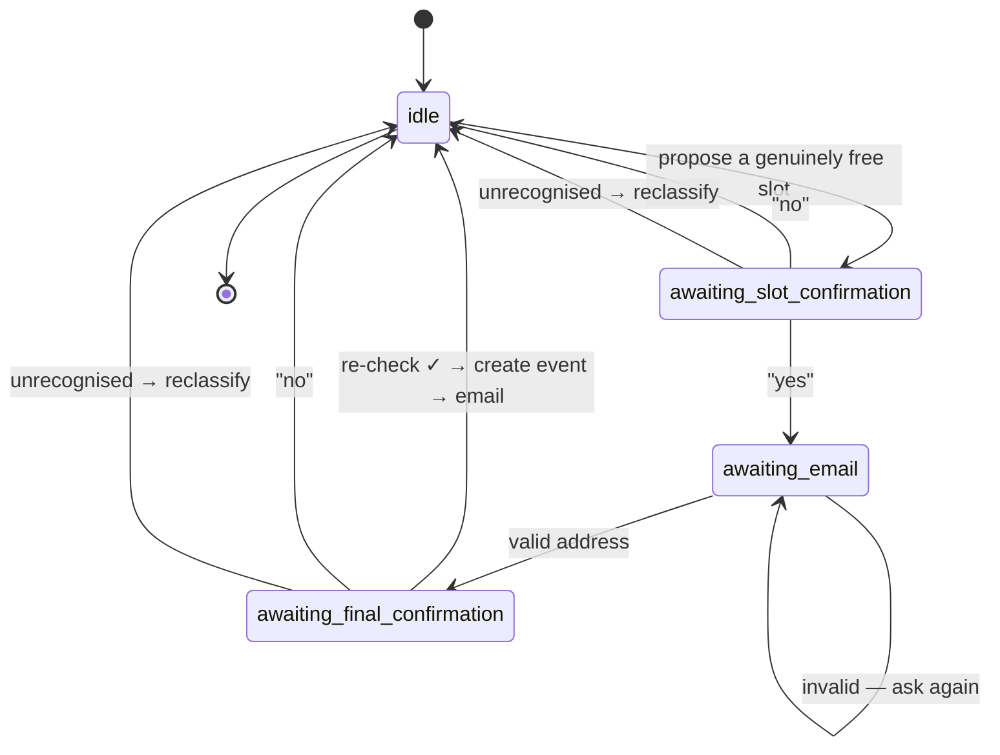

Every transition is deterministic. Classifying "yes" would double the cost of a booking
and add a failure mode to the least ambiguous message in the conversation.

Yes/no parsing requires **every** word to be recognised:

| reply | read as | why |
|---|---|---|
| `yeah go ahead` | ✅ yes | every word known |
| `no thanks` | ❌ no | a negative anywhere wins |
| `ok Tuesday` | ↩️ *reclassify* | names a day the bot never proposed — confirming the old slot would book the wrong appointment |
| `actually can we do 4pm?` | ↩️ *reclassify* | a changed request, not a failed yes/no |

An unrecognised reply goes **back to the classifier** rather than being told to say yes
or no. So "actually can we do 4pm?" re-proposes 4pm.

### A complete booking, end to end

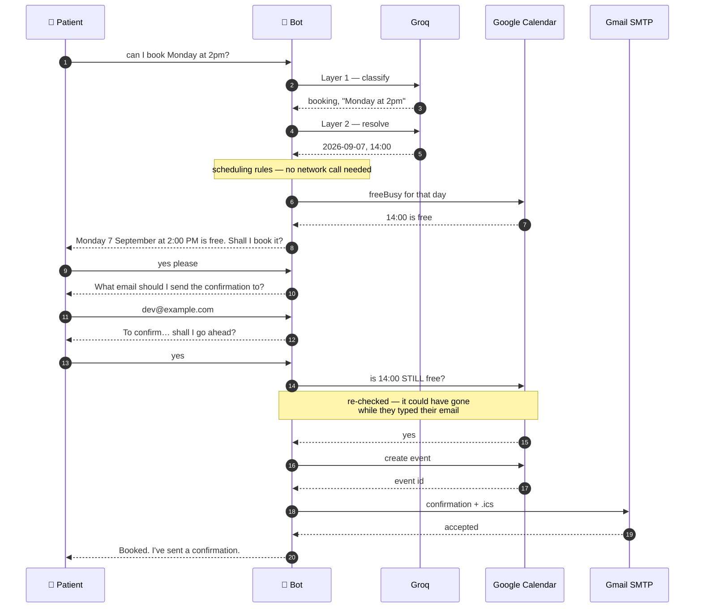

**Availability is re-checked immediately before the event is created.** A slot free when
proposed can be taken while the user types their email — booking on the earlier answer
is how two patients end up in one slot.

---

## Changing an appointment: cancel, or move

Booking is forgiving: a wrong slot is one message away from being fixed. Cancelling is
not. The appointment is gone, the clinic resells the time, and nobody finds out until
someone turns up. **Rescheduling is a cancellation with a booking attached**, so it
inherits every reason cancelling needs care — which is why both live in one flow that
asks a question booking never has to: *is the person typing entitled to do this?*

Telegram answers a different question. It proves this chat is the same chat as
yesterday; it says nothing about which patient that is. The only link between a chat and
an appointment is the email address it was booked with — and an address a stranger can
type is a claim, not proof.

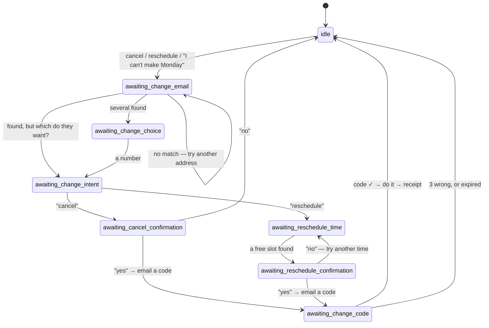

When the intent already says which — `cancel` or `reschedule` — the `awaiting_change_intent`
step is skipped.

| control | value | why that one |
|---|---|---|
| code length | 6 digits | what people expect to retype; the strength is below |
| attempts | **3** | three guesses against 10⁶ — this, not the length, is the number that matters |
| expiry | 10 minutes | bounds how long a code left in an inbox stays useful |
| resends | 3 total | asking again is reasonable; it must not reset the guess budget |
| addresses tried per flow | 5 | a miss keeps the prompt open, but an open prompt is a free calendar query |

**Only a salted hash is stored.** The plaintext exists in one local variable, long enough
to be written into an email, then it is gone — so a Redis snapshot, a log line or a
traceback carries no live code. Six digits is a small space, so this defends against the
code being *seen*, not against someone who already owns the state; the attempt budget is
what makes guessing impractical. A test asserts the code appears in neither
`model_dump_json()` nor the chat history.

### Asking, rather than guessing

Not every message says which one it wants. *"Something came up, I can't make Monday"* is
a problem with an appointment, not an instruction about it — and guessing either destroys
a booking the patient meant to keep or leaves one they meant to drop.

So Layer 1 has a third intent, `change_appointment`, for exactly that, and the prompt
tells it to prefer it over a guess. The question is then asked *after* the appointment is
found, so it costs no extra turn:

```
🧑  something came up, I can't make Monday
🤖  Which email address was the appointment booked with?

🧑  dev@example.com
🤖  I found an appointment for Dev on Monday 7 September at 2:00 PM at 12 Orchard Rd.
    Would you like to move it to another time, or cancel it altogether?
```

> [!WARNING]
> **`"cancel"` at that prompt is an answer, not an escape.** The mid-flow escape hatch
> matches the whole message and `cancel` is one of its words — so without an exemption the
> bot would ask *"move it or cancel it?"*, hear *"cancel"*, abandon the flow and reply
> *"nothing has been cancelled"* to somebody in the middle of cancelling. One word, one
> stage, carved out. `stop`, `quit` and the rest still work there.

A reply naming *both* — "don't cancel it, just move it" — decides nothing and re-asks.

### Moving one: book first, then release

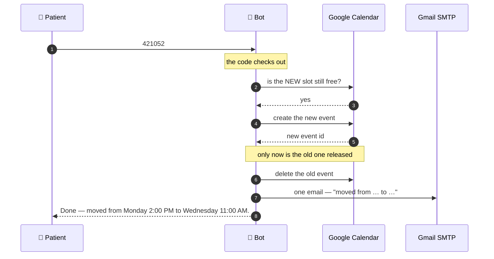

**The order is the safety property.** Cancelling first and then failing to book leaves a
patient with no appointment and no warning. Booking first and then failing to cancel
leaves them with two — visible, recoverable, and said out loud:

> Your appointment is booked for Wednesday 9 September at 11:00 AM. I couldn't release
> the earlier one on Monday 7 September at 2:00 PM though, so it may still be on our
> calendar — please call the clinic so they can clear it.

If the new slot is taken between entering the code and creating the event, the flow drops
back to *"what other time would suit?"* — **without asking for a second code**. Same
person, same flow, same appointment; the verified flag lives until `reset_flow` and no
longer. That last clause is load-bearing: a flag that outlived the flow would let one
code authorise cancelling every appointment the chat could subsequently find, under any
address. A mutation that removed it passed the whole suite on the first attempt, and two
tests now close it.

### The word `"cancel"` means opposite things in the two flows

| reply | in a booking | in a cancel or reschedule |
|---|---|---|
| `cancel it` | ❌ no — don't book | ↩️ *ambiguous* — re-ask |
| `yes cancel it` | ❌ no — a negative anywhere wins | ✅ yes |
| `no don't cancel` | ❌ no | ❌ no |

`read_yes_no` takes a set of **neutral** words, and the change flow passes
`{"cancel"}`. Simply dropping the word from the known list would have turned all three
rows into "unclear", throwing away two answers the user gave plainly.

The same collision reaches the escape hatch. `"cancel"` on its own backs out of whichever
flow is running — and mid-change the reply is *not* "No problem, I've cleared that",
which reads as *cleared your appointment*. It says the appointment is still booked as it
was. That is the one sentence in this app a patient must not misread. (The exception is
the *which-one* prompt above, where the word is an answer.)

### What it refuses to do

- **No code is ever sent to an address with no appointment.** The bot cannot be used to
  make mail arrive somewhere.
- **A code that can't be delivered ends the flow** rather than parking someone at a
  prompt they could never satisfy.
- **A calendar 500 is never reported as "already cancelled"** — that would leave a live
  appointment behind. `EventNotFound` is a distinct exception, and both paths are tested.
- **An unrecognised reply re-asks; it never reroutes.** Booking hands a puzzling reply
  back to the classifier, because "actually can we do 4pm?" is a changed request. Nothing
  at a cancel or reschedule prompt reinterprets that way.
- **A reply that isn't a code costs no attempt.** `"what?"` and `"12345"` are noise, not
  guesses. Only a well-formed 6-digit guess spends one of the three.

> [!NOTE]
> **A trade-off worth naming.** The appointment is described *before* the code is sent,
> which discloses whether a given address has a booking. That is the flow as specified,
> and the requester has already asserted the address — but the alternative ("if that
> address has an appointment, I've sent it a code", details only after verification) is a
> two-line change. See [`prompts/06-cancellation-and-rescheduling.md`](prompts/06-cancellation-and-rescheduling.md).

---

## Two layers, split by what each is trusted with


The model is **never told the opening hours** — and a test asserts the prompt doesn't
mention them.

> A model that misreads "Monday" produces a wrong **date**, which the user can see and
> correct. A model trusted with policy produces a wrong **rule**, which they cannot.

The same principle governs FAQs: answers are returned verbatim from
`app/domain/business.py`, so invented clinic facts are *structurally impossible* rather
than merely discouraged.

Validation **refuses rather than reroutes**. Weekends, past dates and after-hours
requests are declined with an explanation; `next_open_day` only ever *suggests* an
alternative, because `NEAREST_AVAILABLE_RULE` forbids rolling a booking onto another
day. Within a day it does move forward: 14:15 → 14:30 (always rounding **up**, never
offering a slot before the one asked for), and asking for 9am at 11:30 offers 11:30 with
the reason stated — a silent shift is how a patient turns up an hour out.

---

## Quick start

```bash
python -m venv venv
venv/Scripts/pip install -r requirements-dev.txt   # Linux/macOS: venv/bin/pip
cp .env.example .env                               # then fill in the blanks
venv/Scripts/python -m uvicorn app.main:app --port 8000
```

A **Google service-account key** is one of those blanks, and the only one that is not a
line in `.env.example` waiting to be filled. `.env.example` points
`GOOGLE_SERVICE_ACCOUNT_FILE` at `credentials/service-account.json`, a directory
`.gitignore` covers — so a fresh clone has no key, and because credentials resolve
eagerly the app exits with a `ConfigurationError` naming the path instead of binding a
port. Put the key there, or set `GOOGLE_SERVICE_ACCOUNT_JSON` inline; see
[Configuration](#configuration).

Message the bot on Telegram. `GET /health` reports the resolved run mode.

> [!IMPORTANT]
> `tzdata` is a real dependency, not a nicety. Windows ships no system time zone
> database, so `ZoneInfo("Asia/Kolkata")` raises `ZoneInfoNotFoundError` without it and
> the app cannot construct a single valid appointment time.

> [!WARNING]
> **Environment variables outrank `.env`.** That is deliberate — it is how a host
> injects config in production — but a stray `TELEGRAM_BOT_TOKEN` or `GROQ_API_KEY` in
> your shell silently wins over the file. If the bot seems to ignore an edit:
> ```bash
> env -u TELEGRAM_BOT_TOKEN -u GROQ_API_KEY ./venv/Scripts/python -m uvicorn app.main:app --port 8000
> ```

---

## Configuration

Every value comes from the environment; see `.env.example`. Five keys are required and
validated **at startup**, with an error naming the missing one: `TELEGRAM_BOT_TOKEN`,
`GROQ_API_KEY`, `GROQ_MODEL`, `GOOGLE_CALENDAR_ID`, `TIMEZONE`.

Google credentials resolve in order:


The file path resolves against the **project root**, not the working directory, so the
app starts identically from anywhere.

> [!CAUTION]
> In a `.env` file the inline JSON **must be wrapped in single quotes**. Double quotes
> make dotenv expand the `\n` escapes inside `private_key` into real newlines, and a raw
> newline inside a JSON string is invalid JSON.

`settings.email_configured` picks between the real SMTP service and a disabled one at
startup, so the app books appointments without SMTP credentials — only the confirmation
is lost, and the reply says so rather than promising one.

---

## Transports

| `RUN_MODE` | Mechanism | When |
|---|---|---|
| `polling` | background `getUpdates` loop | local dev — no public URL needed |
| `webhook` | `POST /telegram/webhook/{secret}` | deployment |

Webhook mode requires `TELEGRAM_WEBHOOK_SECRET` and `PUBLIC_BASE_URL`, checked at
startup. The route **always returns 200** — a non-200 makes Telegram redeliver with
backoff, so a bug that reliably 500s becomes a retry storm that outlives the deploy.

---

## Design decisions worth defending

<details>
<summary><b>Calendar events never carry attendees</b> — and this one is not optional</summary>

A service account without Domain-Wide Delegation gets `HTTP 403
forbiddenForServiceAccounts`, and that fails the **entire** event creation rather than
degrading. One attendee field would break every booking. Delegation needs a Workspace
domain a personal calendar cannot grant, so the patient's address goes in the event
description, and the `.ics` attachment on the confirmation email is the only route the
appointment has into their own calendar.

*The event is the clinic's record; the email is the patient's.*
</details>

<details>
<summary><b><code>max_tokens</code> is 1024, and the reason is not obvious</b></summary>

Reasoning models spend hidden reasoning tokens *inside* that budget before writing any
answer — measured at **346–376** on this task. The original 300 left no room for the
JSON, and Groq rejected the call with `HTTP 400 json_validate_failed` and an empty
`failed_generation`.

It failed on exactly the inputs a classifier most needs to get right (`"2:15 on Monday"`,
`"7pm on Tuesday"`) and passed on easy ones, so it presented as flakiness. **No unit
test could catch it**, since every test fakes the model; `tests/test_llm.py` asserts the
floor and records why.
</details>

<details>
<summary><b>A failed email never rolls back a booked appointment</b></summary>

The calendar event and the email fail independently, and the reply states which of the
two happened rather than promising a confirmation that never left. The same rule governs
cancellation: a broken SMTP server is not a failed cancellation.
</details>

<details>
<summary><b>Changing an appointment asks for the email every time</b> — even when it's already in state</summary>

The same conversation may have booked something ten messages earlier, with
`patient_email` sitting right there. Reusing it would skip the only step that establishes
*who is asking*, reducing the one-time code to a formality posted to an address the
requester never had to know.
</details>

<details>
<summary><b>Appointments are found by an exact match done in code</b>, not by trusting search</summary>

Two queries run concurrently on every lookup: an exact `privateExtendedProperty` filter,
which cannot miss on tokenisation, and Google's free-text `q`, which is the only thing
that sees events booked before that property existed — those carry the address in their
prose description alone, and `q` does not search extended properties. Neither is a
superset of the other, so results are merged on event id.

It began as "property first, `q` only if empty", which is one request cheaper and hides a
legacy appointment behind a newer tagged one. **The live-calendar run is what caught it.**

Whatever comes back is re-matched exactly on the address, because `q` tokenises, and
**offering someone else's appointment for cancellation is the one mistake this must not
make.**
</details>

<details>
<summary><b>The <code>.ics</code> UID is carried across a reschedule</b>, and the SEQUENCE with it</summary>

The `.ics` attachment is the *only* route an appointment has into the patient's own
calendar, since a service account cannot add them as an attendee. So it has to be right
across the whole life of an appointment, not just at booking.

A booking's UID is its Google event id. Rescheduling necessarily creates a **new** event
— so the UID is carried forward on the new one, stored in `extendedProperties`, and the
cancellation and reschedule mails reuse it. A client that honours the pairing *moves* the
entry instead of filing a second one beside it.

The `SEQUENCE` matters just as much and is easier to miss: a calendar client ignores an
update whose sequence has not increased. Without storing and bumping it, the UID
carry-forward would work exactly once, and a second reschedule would silently leave the
patient looking at the first new time. Both survive a live round trip through Google —
the sequence comes back as the string `"1"`, which is why it is parsed defensively.

Support for `METHOD:CANCEL` and re-issued UIDs is uneven across mail clients, so the
prose says what happened too. The retraction is worth sending, not worth relying on.
</details>

<details>
<summary><b>Rescheduling books the new time before releasing the old</b></summary>

Cancel-then-book risks leaving a patient with no appointment at all. Book-then-cancel
risks leaving them with two — which is visible, recoverable, and reported in plain words
rather than swallowed. A test asserts the call order; another asserts the half-done case
is announced.
</details>

<details>
<summary><b>Slot overlap is half-open at both ends</b></summary>

Back-to-back appointments are not clashes. Treating a shared boundary as a collision
would lose the slot either side of every existing event — about a third of a working
day, for nothing.
</details>

<details>
<summary><b>Naive datetimes raise at construction</b></summary>

Rather than being caught by convention. A naive value reaching the slot search either
raises deep in the call stack or, worse, silently represents the wrong wall clock.
</details>

<details>
<summary><b><code>StateStore</code> is async despite needing no I/O</b></summary>

The intended swap is Redis, whose clients are async. A sync interface would force every
handler to change when that lands.
</details>

<details>
<summary><b>The OpenAI SDK's own retries are disabled</b> (<code>max_retries=0</code>)</summary>

Left on, the required "one retry" silently becomes several, multiplying the wall-clock
time a user waits.
</details>

<details>
<summary><b>No <code>google-api-python-client</code></b></summary>

It is synchronous and builds its own HTTP stack; only a handful of endpoints are needed
— freeBusy, and listing, creating and deleting events — so they are called over httpx
directly. `google-auth` is installed without its `[requests]`
extra for the same reason, with an httpx transport supplied in `calendar_service.py`.
</details>

<details>
<summary><b>Deduplication is bounded</b></summary>

A deque plus a set, capped. Telegram redelivers until acknowledged, and an unbounded set
grows for the life of the process.
</details>

---

## Deployment

```bash
docker build -t brightcare-clinic-bot .
docker run -p 8000:8000 --env-file .env brightcare-clinic-bot
```

The image is host-agnostic; `render.yaml` is one worked example, not a requirement.

### Choose the service type first — it decides everything else

| host service type | `RUN_MODE` | why |
|---|---|---|
| background worker / always-on | `polling` | no public URL needed; simplest |
| free-tier **web** service | `webhook` | free tiers sleep when idle, and a sleeping worker cannot poll — the inbound request is what wakes it |

### The chicken-and-egg step

`PUBLIC_BASE_URL` cannot be set before the service exists, because the host assigns it:

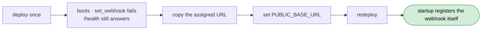

Startup refuses webhook mode without `PUBLIC_BASE_URL` **and**
`TELEGRAM_WEBHOOK_SECRET`, so a half-configured deploy fails immediately with a message
naming the missing key rather than going quietly deaf.

### One worker, deliberately

`--workers 1` is pinned in the Dockerfile. Conversation state lives in memory, so a
second worker is a second process with its own view of every conversation — a user could
be asked for their email by one worker and have the reply land on another that has never
heard of them. State also does not survive a restart, which free tiers do often: an
in-flight booking is lost, though a **completed** one is safe on the calendar. Both are
fixed by the same thing — the Redis backend the `StateStore` interface already allows.

### CI

`.github/workflows/ci.yml` runs on every push and pull request:

| job | what it proves |
|---|---|
| **test** | the full suite runs with **no secrets**, because every external service is faked |
| **secrets** | no credential shapes in tracked files, and `.env` / `credentials/` are still ignored |
| **build** | the image assembles, serves `/health`, runs unprivileged, and carries no `.env` |

The PEM pattern requires real key material *after* the marker, so test fixtures
containing `BEGIN PRIVATE KEY-----\nnotarealkey` don't trip it — a scanner that cries
wolf is one that gets disabled. The build job generates a throwaway RSA key with
`openssl`, because a placeholder string cannot work: config resolves credentials eagerly
and google-auth rejects a fake PEM.

---

## Secrets

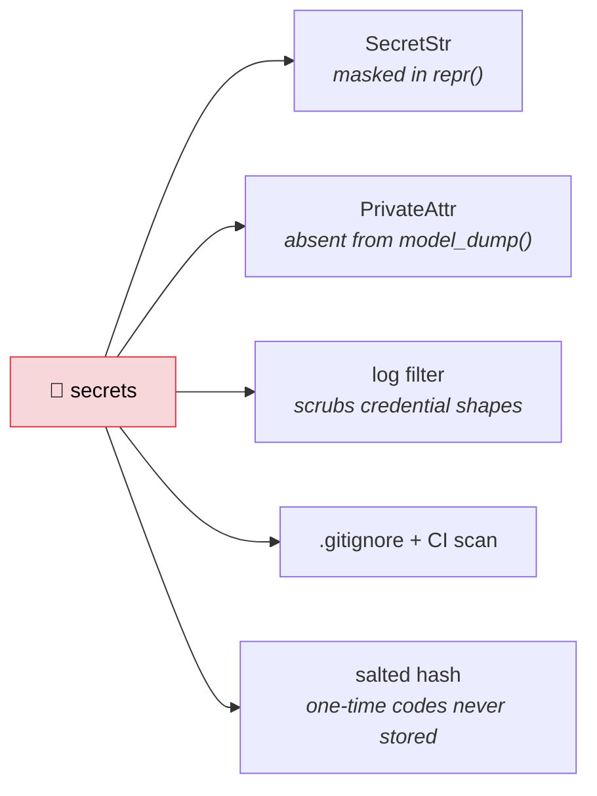

`.env`, `credentials/` and conversation exports are gitignored. Logging defends the same
data twice: callers log `text_fingerprint()` (length plus a short hash) rather than
message bodies, **and** a filter scrubs credential patterns at every level plus emails
from user-content fields at INFO and above. `httpx` is held at WARNING because its INFO
request line contains the bot token.

A one-time code never reaches state at all — only a salted SHA-256 of it does, compared
with `secrets.compare_digest`. What that buys, and what it does not, is argued where the
flow is described: [Changing an appointment](#changing-an-appointment-cancel-or-move).

---

## Tests

```bash
venv/Scripts/python -m pytest
```

**509 tests.** Groq is faked at the `complete_json` seam — the narrowest point that still
exercises parsing, validation and error handling. Google is faked at the HTTP layer with
`respx`, so request bodies are *asserted* rather than assumed.

Several tests assert work **not** done:

- a sticker costs zero model calls
- a mid-flow reply skips the classifier entirely
- a booking with no time phrase never reaches Layer 2
- `create_event` never sends an `attendees` key
- no one-time code is emailed to an address with no appointment
- a reschedule books the new time *before* releasing the old one
- a one-time code appears in no reply, no log line, and no serialised state

### Verified by mutation, not just by passing

A passing suite proves the code does what the tests say. It does not prove the tests
would notice if it stopped. So each of these breakages is applied deliberately, and the
suite is run against it:

| booking and scheduling | caught by |
|---|---|
| round slots **down** instead of up | 9 tests |
| drop the weekend check | 5 tests |
| roll a late request to the next day | 4 tests |
| accept `"ok Tuesday"` as a yes | 4 tests |
| skip the pre-booking availability re-check | 2 tests |
| send attendees to Google | 1 test |
| let a failed email roll back the booking | 1 test |
| leave a placeholder unsubstituted in a prompt | 1 test |

For cancelling and rescheduling, **34 mutations, all 34 caught** — run in one pass
against the current tree. The sharpest few:

| cancelling and rescheduling | |
|---|---|
| let the plaintext code reach serialised state | caught |
| draw codes from a predictable source | caught |
| delete the event before checking the code | caught |
| cancel the old appointment before booking the new one | caught |
| trust Google's free-text search without an exact re-check | caught |
| report a calendar 500 as "already cancelled" | caught |
| let the escape hatch swallow "cancel" at the which-one prompt | caught |
| give the moved appointment a fresh calendar UID | caught |

<details>
<summary>All 34</summary>

**The one-time code** — let the plaintext reach serialised state · draw codes from a
predictable source · expire a code only *after* the attempt is spent · leave a live code
alive across flows · drop the verified flag out of `reset_flow` · drop it out of
`start_change` · spend an attempt on a reply that was never a code · keep the flow alive
after three wrong codes · keep sending the old code after a resend · let the resend
budget run forever · park the user at a code prompt when the mail failed

**Finding the appointment** — trust Google's free-text search without an exact re-check ·
hide a legacy appointment behind a tagged one · skip the no-match branch entirely · let
the lookup prompt stay open forever · reset to idle after a miss, breaking the offer to
look again · reuse the booking address instead of asking · mine a long reply for a stray
number at the choice prompt

**Doing it** — delete the event before checking the code · report a calendar 500 as
"already cancelled" · cancel the old appointment before booking the new one · skip the
re-check on the new slot · stay quiet when the old appointment could not be released ·
make them verify again after a lost race · send the reschedule confirmation as a
cancellation

**The patient's own calendar** — give the cancellation `.ics` a fresh UID · give the
moved appointment a fresh UID · reuse the same `SEQUENCE` on every move

**Reading the user** — read `"cancel"` as a refusal inside a change · guess `"cancel"`
when the user named both actions · offer the slot after the one they already hold

**The orchestrator** — let the escape hatch swallow `"cancel"` at the which-one prompt ·
say "I've cleared that" when backing out of a change · report the reschedule
continuation as free
</details>

### Three of them passed on the first attempt

That is the part worth reporting. The suite was green, the code was wrong, and nothing
said so:

| the hole | what it would have allowed |
|---|---|
| reuse the booking address instead of asking | the one-time code posted to an address the requester never had to know |
| mine a long reply for a stray number at the choice prompt | *"I have 2 appointments, which is which"* read as picking number 2 |
| **drop the verified flag out of `reset_flow`** | **one code authorising the cancellation of every appointment the chat could find afterwards, under any address** |

Tests closing all three were written in response, and the mutations now fail. The last
one is the reason this section exists: it is invisible to review, invisible to a passing
suite, and a straightforward privilege leak.

---

## Layout

```
app/
  config.py            settings, credential resolution, ZoneInfo
  logging_config.py    JSON logs, secret redaction
  main.py              FastAPI, lifespan, /health, webhook route
  telegram/            client, handle_update entrypoint, polling runner
  agent/               llm, router (Layer 1), resolver (Layer 2),
                       orchestrator, prompts, parsing,
                       handlers/ (booking, changes, faq, greeting, …)
  state/               ConversationState, StateStore + InMemoryStateStore
  domain/business.py   clinic facts, hours, slot grid, booking rule
  domain/scheduling.py business-hours validation, slot alignment
  domain/otp.py        one-time codes: hashing, expiry, attempt budget
  services/            calendar + email, both live
prompts/               the prompt driving each phase, with its assumptions
tests/
```

---

## Phase status

| Phase | Scope | State |
|---|---|---|
| 1 | Scaffold, transports, routing layer | ✅ complete |
| 2 | Datetime resolution, business-hours validation | ✅ complete |
| 3 | Calendar availability, slot search, event creation | ✅ complete |
| 4 | Email confirmation | ✅ complete |
| 5 | Deployment | ✅ complete |
| 6 | Cancelling and rescheduling, verified by a one-time code | ✅ complete |

Each phase's prompt and its full assumption list live in [`prompts/`](prompts/).

**Not built:** a staff-side path. Every change goes through the patient's inbox, so
nobody can cancel or move an appointment without access to the address it was booked
with — including the clinic.
